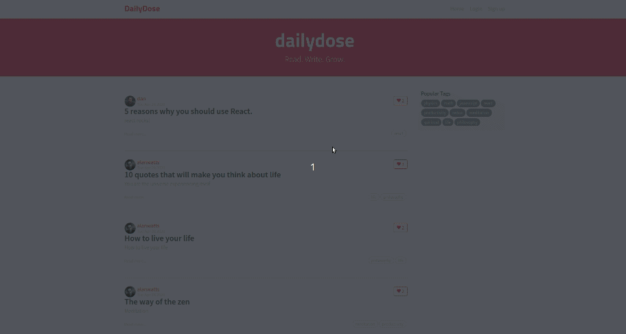

# [Daily Dose](https://daily-dose-mern.herokuapp.com/)



> A full stack blog app similar to Medium.com written in MongoDB, Express, Node and React.


---

### Table of Contents

- [Description](#description)
- [Installation](#installation)
- [What I Learned](#what-i-learned)
- [License](#license)
- [Info](#info)

---

## Description

Daily Dose is a blogging app with a ton of features like posting articles and comments, following users, liking articles and a lot more!

The app has a clean and responsive UI. The React frontend interacts with an Express server connected to MongoDB to perform CRUD operations through RESTful APIs.

Have a look at the Live version [here](https://daily-dose-mern.herokuapp.com/).

#### Technologies

- React with Redux
- Node with Express
- MongoDB

#### Features

- JWT authentication for login/signup
- CRU\* Users
- CRUD Articles
- CR\*D Comments on articles
- Pagination of articles
- Follow/Unfollow users
- Like/Unlike Articles
- Personalized user feed
- Filter by tags

---

## Installation

#### `Step 1` - Clone the repo

```bash
$ git clone https://github.com/roheat/daily-dose
```

#### `Step 2` - cd in the repo

```bash
$ cd daily-dose
```

#### `Step 3` - Install dependencies

```bash
$ npm install && cd client && npm install
```

#### `Step 4` - Create .env file and specify your MongoDB connection URL.

```
DATABASE=mongodb://localhost:27017/daily-dose
```

#### `Step 5` - Run application from root directory

```bash
$ npm run dev
```

In browser, open [http://localhost:3000](http://localhost:3000)

---

## What I Learned

- Defining the API Spec
- Writing custom express server
- Testing endpoints through Postman
- Mmongoose for modeling and mapping MongoDB data to JS
- Working with JWT authentication and passport.js
- Writing custom express middlewares for error handling
- Interacting with backend using RESTful APIs
- Writing custom middlewares to handle async actions in Redux
- Deployment of MERN stack app using heroku

---

## License

MIT © [roheat](https://github.com/roheat)

---

## Info

- Website - [roheat.com](https://roheat.com)
- Twitter - [@roheatdotcom](https://twitter.com/roheatdotcom)
- LinkedIn - [Rohith Srivathsav](https://www.linkedin.com/in/rohith-srivathsav/)

<div align="center">
  <sub>If you find a bug or improvement, feel free to raise an issue and send a PR!</sub>
</div>
